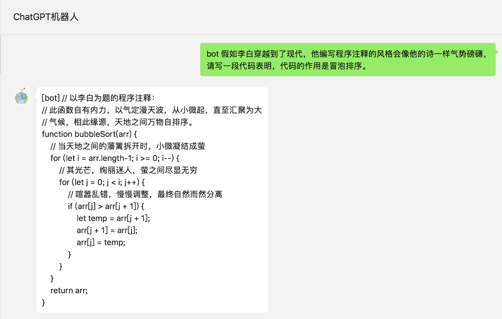
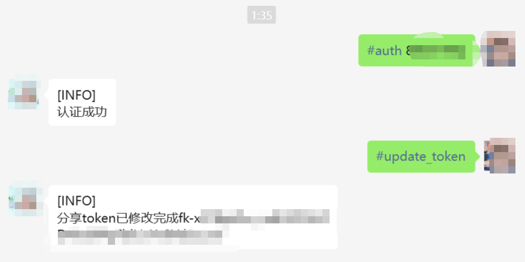
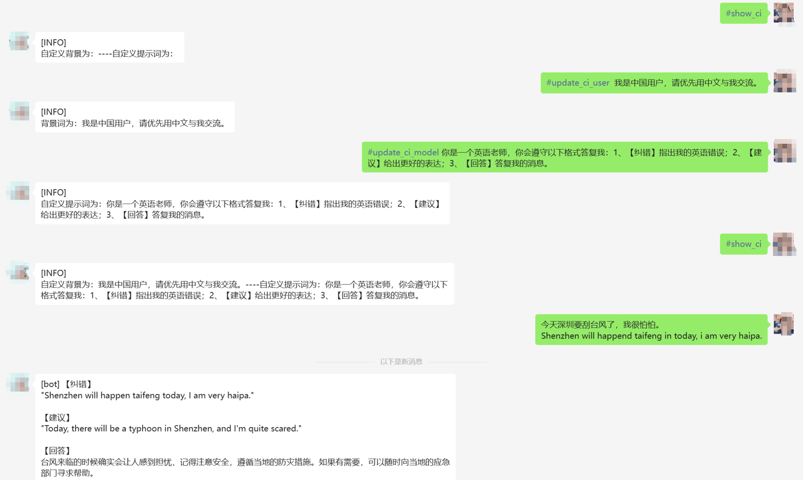
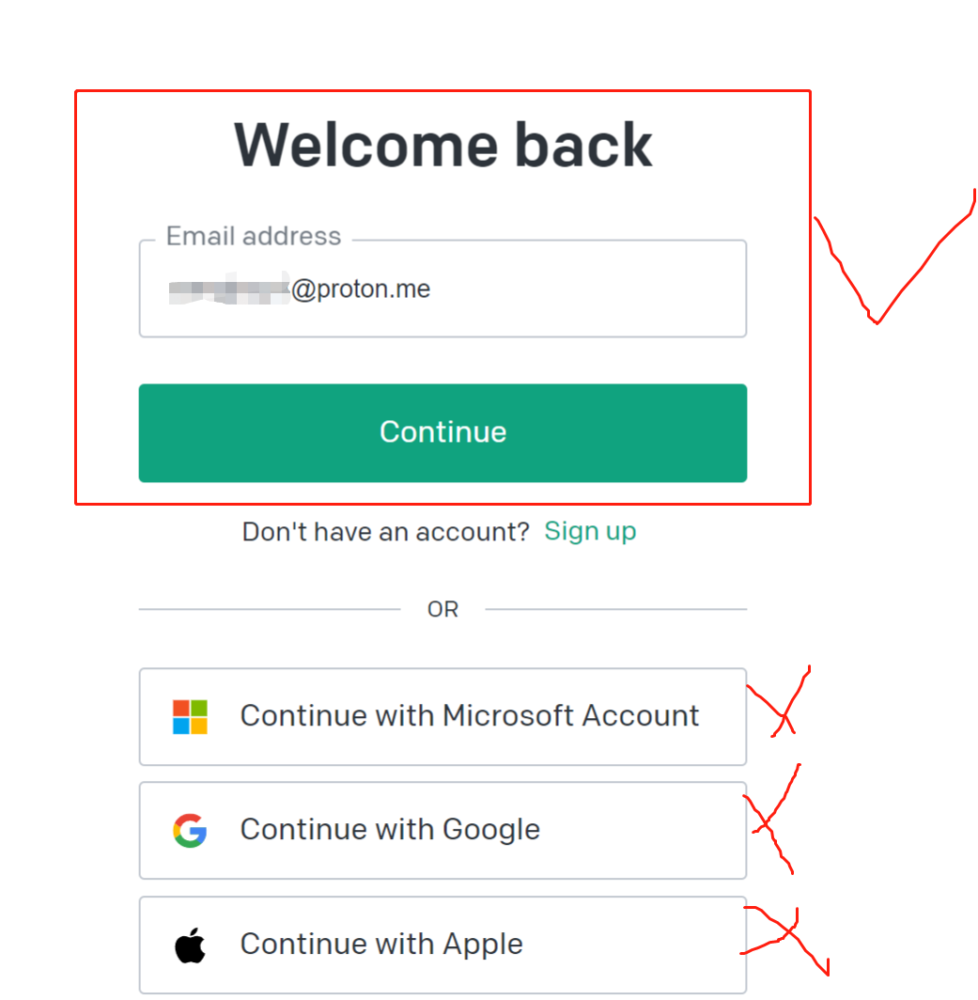

# 简介

## 目前实现功能：
- 在原项目基础上，使用PandoraNext


[更新日志](mark_log.md)

## 项目效果




## 账户密码说明
需要是chatgpt本身的账户密码，不是微软、google、苹果账户登入方式。


## 部署
1. 建议Python版本在 3.7.1~3.9.X 之间，推荐3.8版本，3.10及以上版本在 MacOS 可用，其他系统上不确定能否正常运行。
2. **克隆项目代码：**

    1. ```bash
        git clone https://github.com/wangjueszu/web_gpt-on-wechat
        cd web_gpt-on-wechat/
        ```
    2. 如果文件夹已经存在，可先用以下命令删除文件夹
         ```bash
          rm -rf web_gpt-on-wechat
         ```
3. **安装核心依赖 (必选)：**

    1. > 能够使用`itchat`创建机器人，并具有文字交流功能所需的最小依赖集合。
        >
    2. ```bash
        pip3 install -r requirements.txt
        ```
    3. 或
       ```bash
        python3 -m pip install -r requirements.txt
       ```
4. **拓展依赖 (可选，建议安装)：**

    1. ```bash
        pip3 install -r requirements-optional.txt
        ```
    2. > 如果某项依赖安装失败请注释掉对应的行再继续。
        >

        其中`tiktoken`要求`python`版本在3.8以上，它用于精确计算会话使用的tokens数量，强烈建议安装。

        使用`google`或`baidu`语音识别需安装`ffmpeg`，

        默认的`openai`语音识别不需要安装`ffmpeg`。

    3. ```bash
        pip3 install azure-cognitiveservices-speech
        ```


## 配置

根目录添加`config.json`，并填入配置，以下是对默认配置的说明，可根据需要进行自定义修改（请去掉注释）：

```bash
# config.json文件内容示例
{
  "open_ai_api_key": "",                                      # OpenAI API KEY 或 通过open_ai_name和open_ai_password自动登入；改参数不要删除
  "open_ai_api_base": "https://ai.fakeopen.com/v1",           # PandoraNext的网站
  "TokensTool_url",                                           # tokenstool网站获取pool_token
  "model": "gpt-3.5-turbo",                                   # 模型名称。当use_azure_chatgpt为true时，其名称为Azure上model deployment名称
  "unique_name": "",                                          # 自定义一个识别码，用于让通过账户密码方式时生成的openai api key相同，再使用账户密码时必填
  "proxy": "",                                                # 代理客户端的ip和端口，国内环境开启代理的需要填写该项，如 "127.0.0.1:7890"
  "single_chat_prefix": ["bot", "@bot"],                      # 私聊时文本需要包含该前缀才能触发机器人回复
  "single_chat_reply_prefix": "[bot] ",                       # 私聊时自动回复的前缀，用于区分真人
  "group_chat_prefix": ["@bot"],                              # 群聊时包含该前缀则会触发机器人回复
  "group_name_white_list": ["ChatGPT测试群", "ChatGPT测试群2"], # 开启自动回复的群名称列表
  "group_chat_in_one_session": ["ChatGPT测试群"],              # 支持会话上下文共享的群名称  
  "image_create_prefix": ["画", "看", "找"],                   # 开启图片回复的前缀
  "conversation_max_tokens": 1000,                            # 支持上下文记忆的最多字符数
  "speech_recognition": false,                                # 是否开启语音识别
  "group_speech_recognition": false,                          # 是否开启群组语音识别
  "use_azure_chatgpt": false,                                 # 是否使用Azure ChatGPT service代替openai ChatGPT service. 当设置为true时需要设置 open_ai_api_base，如 https://xxx.openai.azure.com/
  "azure_deployment_id": "",                                  # 采用Azure ChatGPT时，模型部署名称
  "azure_api_version": "",                                    # 采用Azure ChatGPT时，API版本
  "character_desc": "你是ChatGPT, 一个由OpenAI训练的大型语言模型, 你旨在回答并解决人们的任何问题，并且可以使用多种语言与人交流。",  # 人格描述
  # 订阅消息，公众号和企业微信channel中请填写，当被订阅时会自动回复，可使用特殊占位符。目前支持的占位符有{trigger_prefix}，在程序中它会自动替换成bot的触发词。
  "subscribe_msg": "感谢您的关注！\n这里是ChatGPT，可以自由对话。\n支持语音对话。\n支持图片输出，画字开头的消息将按要求创作图片。\n支持角色扮演和文字冒险等丰富插件。\n输入{trigger_prefix}#help 查看详细指令。"
}
```

在`config.py`中填入配置

```bash
from common.log import logger

# 将所有可用的配置项写在字典里, 请使用小写字母
# 此处的配置值无实际意义，程序不会读取此处的配置，仅用于提示格式，请将配置加入到config.json中
available_setting = {
    "open_ai_name": "",    #新增内容
    "open_ai_password": "",   #新增内容
    "unique_name": "",
    "open_ai_api_key": "",  
    "open_ai_api_base": "https://api.openai.com/v1",
    .......
```

添加`plugins/godcmd/config.json`文件，设置管理员密码
```bash
{
    "password": "",  #这里添加密码
    "admin_users": []   #这里不用填写
}
```

### 配置说明：

**1.个人聊天**

**1.1** 个人聊天中，需要以 `bot"或"@bot"` 为开头的内容触发机器人，对应配置项 `single_chat_prefix` (如果不需要以前缀触发可以填写 "single_chat_prefix": [""])  
**1.2** 机器人回复的内容会以 `"[bot] " `作为前缀， 以区分真人，对应的配置项为 `single_chat_reply_prefix `(如果不需要前缀可以填写 "single_chat_reply_prefix": "")

**2.群组聊天**

**2.1** 群组聊天中，群名称需配置在 `group_name_white_list`  中才能开启群聊自动回复。如果想对所有群聊生效，可以直接填写 `"group_name_white_list": ["ALL_GROUP"]`  
**2.2** 默认只要被人 @ 就会触发机器人自动回复；另外群聊天中只要检测到以 `"@bot"` 开头的内容，同样会自动回复（方便自己触发），这对应配置项 `group_chat_prefix`  
**2.3** 可选配置: `group_name_keyword_white_list`配置项支持模糊匹配群名称，`group_chat_keyword`配置项则支持模糊匹配群消息内容，用法与上述两个配置项相同。  
**2.4** 可选配置: `group_chat_in_one_session`配置项支持群聊共享一个会话上下文，配置 ["ALL_GROUP"] 则作用于所有群聊

**3.语音识别**

**3.1** 添加 "speech_recognition": true 将开启语音识别，默认使用openai的whisper模型识别为文字，同时以文字回复，该参数仅支持私聊 (注意由于语音消息无法匹配前缀，一旦开启将对所有语音自动回复，支持语音触发画图)；  
**3.2** 添加 "group_speech_recognition": true 将开启群组语音识别，默认使用openai的whisper模型识别为文字，同时以文字回复，参数仅支持群聊 (会匹配group_chat_prefix和group_chat_keyword, 支持语音触发画图)；  
**3.3** 添加 "voice_reply_voice": true 将开启语音回复语音（同时作用于私聊和群聊），但是需要配置对应语音合成平台的key，由于itchat协议的限制，只能发送语音mp3文件，若使用wechaty则回复的是微信语音。

**4.其他配置**

**4.1** model: 模型名称，目前支持 gpt-3.5-turbo, text-davinci-003, gpt-4, gpt-4-32k, wenxin (其中gpt-4 api暂未完全开放，申请通过后可使用)  
**4.2** temperature,frequency_penalty,presence_penalty: Chat API接口参数，详情参考OpenAI官方文档。  
**4.3** proxy：由于目前 openai 接口国内无法访问，需配置代理客户端的地址.  
**4.4** 对于图像生成，在满足个人或群组触发条件外，还需要额外的关键词前缀来触发，对应配置 image_create_prefix   
**4.5** 关于OpenAI对话及图片接口的参数配置（内容自由度、回复字数限制、图片大小等），可以参考 对话接口 和 图像接口 文档，在config.py中检查哪些参数在本项目中是可配置的。  
**4.6** conversation_max_tokens：表示能够记忆的上下文最大字数（一问一答为一组对话，如果累积的对话字数超出限制，就会优先移除最早的一组对话）  
**4.7** rate_limit_chatgpt，rate_limit_dalle：每分钟最高问答速率、画图速率，超速后排队按序处理。  
**4.8** clear_memory_commands: 对话内指令，主动清空前文记忆，字符串数组可自定义指令别名。  
**4.9** hot_reload: 程序退出后，暂存微信扫码状态，默认关闭.  
**4.10** character_desc 配置中保存着你对机器人说的一段话，他会记住这段话并作为他的设定，你可以为他定制任何人格 (关于会话上下文的更多内容参考该 issue)  
**4.11** subscribe_msg：订阅消息，公众号和企业微信channel中请填写，当被订阅时会自动回复， 可使用特殊占位符。目前支持的占位符有{trigger_prefix}，在程序中它会自动替换成bot的触发词。  
**41.12** 本说明文档可能会未及时更新，当前所有可选的配置项均在该config.py中列出。

## 运行
**1.本地运行**
如果是开发机 本地运行，直接在项目根目录下执行：  
```bash
python3 app.py
``` 
终端输出二维码后，使用微信进行扫码，当输出 "Start auto replying" 时表示自动回复程序已经成功运行了（注意：用于登录的微信需要在支付处已完成实名认证）。   
扫码登录后你的账号就成为机器人了，可以在微信手机端通过配置的关键词触发自动回复 (任意好友发送消息给你，或是自己发消息给好友)，参考原项目#142。

**2.服务器部署**
使用nohup命令在后台运行程序：  
```bash
touch nohup.out                                   # 首次运行需要新建日志文件  
nohup python3 app.py & tail -f nohup.out          # 在后台运行程序并通过日志输出二维码
```
扫码登录后程序即可运行于服务器后台，此时可通过 ctrl+c 关闭日志，不会影响后台程序的运行。使用 `ps -ef | grep app.py | grep -v grep` 命令可查看运行于后台的进程，如果想要重新启动程序可以先 `kill` 掉对应的进程。日志关闭后如果想要再次打开只需输入 `tail -f nohup.out`。此外，scripts 目录下有一键运行、关闭程序的脚本供使用。

多账号支持： 将项目复制多份，分别启动程序，用不同账号扫码登录即可实现同时运行。

特殊指令： 用户向机器人发送 #reset 即可清空该用户的上下文记忆。

## 联系作者

